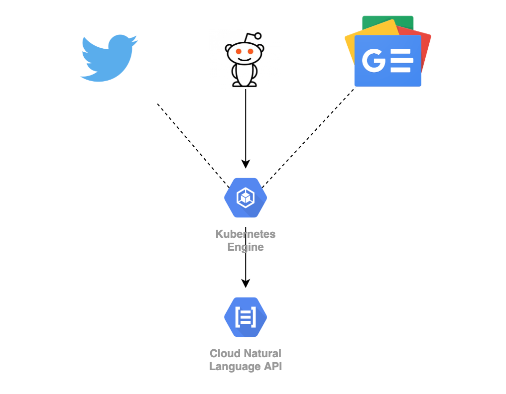
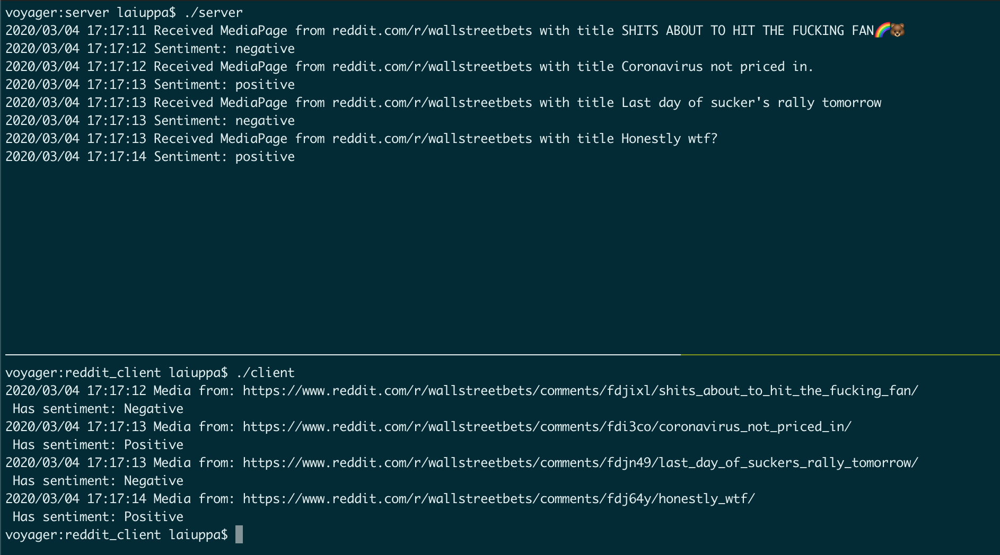
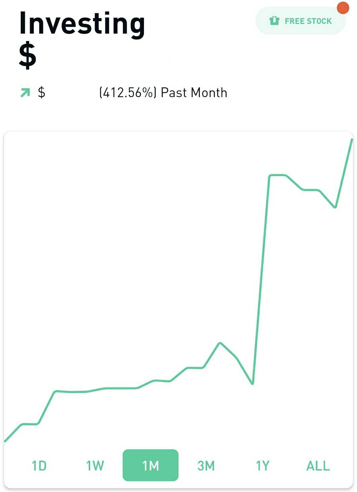

### Intro
---

In 2019 I had my first opportunity to drive a Tesla Model 3. This cemented in my mind that it was a car years ahead of the automotive industry, [and through technical analysis others seem to agree.](https://finance.yahoo.com/news/tesla-model-3-teardown-finds-192850362.html) Despite this I didn't think to buy any stock, shortly after driving the car it shot up from $330 to over $900. This event fostered a deeper interest in finance, eventually resulting in this post. 

While reading through some forums I saw a user lamenting how they would like a gauge of market sentiment. 

So how hard is it for us to scrape social media and have AI/ML tell us how everyone's feeling?

### Overview
---

Let's think of what is needed to accomplish this goal, mainly an AI/ML that does sentiment analysis, and something to scrape social media posts for processing. 

For something this simple theres no need to build our own AI/ML, so lets get [Google's Natural Language Processing API](https://cloud.google.com/natural-language) to do the heavy lifting for us. If our needs were more targeted we would cant to create our own model and train it against our AI/ML.

Next lets use Golang Reddit API Wrapper (GRAW) to harvest posts from Reddit for analysis. 

But what if we wanted to scrape other sites, like Twitter or news articles? We would need to decouple the code that does sentiment analysis from the harvesting code. 

So we'll just start off decoupled by implementing our logic with a Client-Server GRPC model. GKE is used here as this code is all made with the thought of being containerized and ran in Kubernetes upon deployment.





### Methodology
---

First identify what sort of data we'll be working with. [GRPC](https://grpc.io/) perfectly lines up with this task as it defines data models using [Protobuf3](https://developers.google.com/protocol-buffers). GRPC will then generate the function stubs for our Client and Sever. This sounds way better than having to write API routes and simple things like GET or POST.

We'll send our service a `MediaPage` data structure and it'll send us back a `MediaAnalysis`. 

From there the returned payload could be sent to a database for retention and future display, or sent off to an ETL for further kinds of analysis.

Here what the .proto file looks. 

```go
syntax = "proto3";

package redsense;

service RedsenseService {
    rpc Generate(MediaPage) returns (MediaAnalysis);
}

message MediaPage {
  string source = 1;
  string url = 2;
  string title = 3;
  string body = 4;
  uint64 datetime =5;
}

message MediaAnalysis {
  string source = 1;
  string url = 2;
  string title = 3;
  string body = 4;
  uint64 datetime =5;
  string sentiment = 6;
}

```

With this setup one can run `protoc --go_out=plugins=grpc:. *.proto` and out comes a `.pb.go` file with our function stubs. 

With the core code generated the next step is to to setup a quick _server.go_ and _client.go_. 

For the server we just need to extend the `Generate` function outlined in the _.proto_ and have it execute sentiment analysis before returning a `MediaAnalysis`.

```go
func (s *redsenseService) Generate(ctx context.Context, in *pb.MediaPage) (*pb.MediaAnalysis, error) {
  log.Printf("Received MediaPage from %v with title %v", in.Source, in.Title)
  
  //Here we send the text body off for sentiment analysis
  sentiment := analyzeSentiment(in.Body)

  return &pb.MediaAnalysis{
    Source: in.Source,
    Url: in.Url,
    Title: in.Title,
    Body: in.Body,
    Datetime: in.Datetime,
    Sentiment: sentiment,
  }, nil
}

func analyzeSentiment(text string) string{
  ctx := context.Background()

  // Creates a client.
  client, err := language.NewClient(ctx)
  if err != nil {
    log.Fatalf("Failed to create client: %v", err)
  }

  // Sets the text to analyze.
  t := text

  // Detects the sentiment of the text.
  sentiment, err := client.AnalyzeSentiment(ctx, &languagepb.AnalyzeSentimentRequest{
    Document: &languagepb.Document{
      Source: &languagepb.Document_Content{
        Content: t,
      },
      Type: languagepb.Document_PLAIN_TEXT,
    },
    EncodingType: languagepb.EncodingType_UTF8,
  })
  if err != nil {
    log.Fatalf("Failed to analyze text: %v", err)
  }


  if sentiment.DocumentSentiment.Score >= 0 {
    log.Println("Sentiment: positive")
    return "Positive"
  } else {
    log.Println("Sentiment: negative")
    return "Negative"
  }
}
  
```

This is made pretty easy as Googles NLP API also has a Protobuf structure for invoking it, allowing us to easily make the API call and pass the data similar to how it's passed between our Client-Server services. 

Now that we know what the server logic looks like, lets look at the client. 

Harvesting Reddit posts is pretty easy.

All thats needed is to setup the logic to harvest posts using GRAW and then pack the data into the `MediaPage` Protobuf before sending it off to our server.


```go
func shipIt(out pb.MediaPage)(*pb.MediaAnalysis,error){
  conn, err := grpc.Dial(address, grpc.WithInsecure())
  if err != nil {
    log.Fatalf("did not connect: %v", err)
  }
  defer conn.Close()

  c := pb.NewRedsenseServiceClient(conn)
  ctx, cancel := context.WithTimeout(context.Background(), time.Second*5)
  defer cancel()

  r, err := c.Generate(ctx, &out)
  if err != nil {
    log.Fatalf("could not greet: %v", err)
  }

  log.Printf("Media from: %s\n Has sentiment: %s\n", r.Url, r.Sentiment)

  return r,nil
}


func readdit(){

  bot, err := reddit.NewBotFromAgentFile("../config/example.agent", 0)
  if err != nil {
    fmt.Println("Failed to create bot handle: ", err)
    return
  }

  harvest, err := bot.Listing("/r/investing", "")
  if err != nil {
    fmt.Println("Failed to fetch /r/investing: ", err)
    return
  }

  for _, post := range harvest.Posts[:20] {

    if containsSubs(post.SelfText){
      out := pb.MediaPage{
        Source: "reddit.com/r/investing",
        Url:post.URL,
        Title:post.Title,
        Body:post.SelfText,
        Datetime:post.CreatedUTC,
      }
      shipIt(out)
    }
  }

}
```

All thats going on above is calling the GRAW function to harvest some Reddit posts, then if it contains a keyword we care for, pack it into the `MediaPage` Protobuf.

Next send it to the server by setting up the GRPC client with our generated stubs, and then call the `Generate` function that was defined and extended earlier.

The final result winds up looking something like this.




### Conclusion
---

Not only did Google's NLP API make it dead simple  to quickly get sentiment analysis, but GRPC made it easy to break things apart into a remote service model so our Reddit Harvester and processing logic were separate. There's many benefits to this from a deployment perspective, but thats more for a DevOps oriented post. 

With all of the options available in Cloud Platforms we can easily throw together systems like this in no time. 

On top of this theres a multitude of other services you can roll into your intelligence gathering, such as [Google Trends](https://trends.google.com/trends/?geo=US), historical stock data such as volume/OHLC, and maybe some reconnaissance tools to [identify unusual options](https://colab.research.google.com/drive/1cnyERosVMoxo2Q0wT3gWvKnzh85FThNg) or [visualize options data](https://github.com/Andrew-Reis-SMU-2022/Options_Based_Trading). 

A month of studying and trading so far has yielded a 410% portfolio increase. Not too shabby for missing that great Tesla price surge. 




***Disclaimer, none of this is meant to be in any form financial advice or suggestions. What do you do with your investing is of your own volition and risk.***
